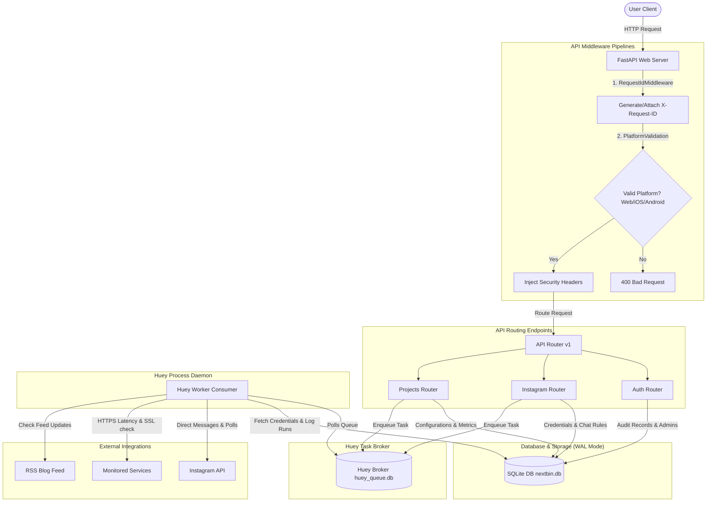

# Nextbin.in (NILA) System Flow & Architecture Documentation

This document describes the complete modular monolith architecture, module flow, request lifecycle, data schema, background worker tasks, and security design for the **Nextbin.in Automation Suite (NILA)**.

---

## 1. System Architecture Overview

NILA is structured as a lightweight, resilient **modular monolith** optimized to run on mobile and resource-constrained environments (such as Termux on Android) as well as desktop development environments.



---

## 2. Core Modules Specifications

### 2.1 Configuration & Database Engine
* **Path**: `app/core/config.py` & `app/core/database.py`
* **Flow & Purpose**:
  1. Loads variables from the local `.env` file via `pydantic-settings`. Configures keys (JWT, AES Fernet Encryption) and database files paths.
  2. Sets up the SQLAlchemy asynchronous engine utilizing `aiosqlite`.
  3. Registers connection events to tune SQLite dynamically:
     - `PRAGMA journal_mode=WAL;` - Enables Write-Ahead Logging. This allows Uvicorn (FastAPI) and Huey background workers to read and write concurrently without hitting "database is locked" errors.
     - `PRAGMA synchronous=NORMAL;` - Minimizes disk sync operations for high performance.
     - `PRAGMA foreign_keys=ON;` - Enforces database-level relational integrity constraints.
  4. Provides the `get_db` async session generator injected as dependencies in route handlers.

### 2.2 Security, Cryptography & Encryption
* **Path**: `app/core/security.py`
* **Flow & Purpose**:
  1. **Password Hashing**: Utilizes direct native `bcrypt` functions (`hashpw`, `checkpw`) to store and verify operator password hashes safely, bypassing buggy legacy package wrappers.
  2. **Credential Encryption**: Uses symmetric **AES-256 (Fernet)** cryptography. Sensitive values, such as Instagram account passwords and authorization tokens, are encrypted before database persistence. Decryption occurs on the fly within the task executors.
  3. **Access Tokens**: Employs JSON Web Tokens (`PyJWT`) to sign and verify session keys with a configured lifetime constraint (default: 24 hours).

### 2.3 Custom Process-Isolated Logging
* **Path**: `app/core/logging.py`
* **Flow & Purpose**:
  1. Configures isolated rotating file loggers to prevent multi-process file locks on Windows environments.
  2. Initializes a different configuration depending on the active process context:
     - **API process (`api`)**: Directs FastAPI, Uvicorn access/error, and middleware logs to `logs/api.log` and general system events to `logs/info_api.log`.
     - **Worker process (`worker`)**: Directs task worker, scheduling events, monitoring telemetry, and Instagrapi errors to `logs/worker.log` and general worker stdout logs to `logs/info_worker.log`.
  3. Formats logs with `%(asctime)s [%(levelname)s] %(name)s: %(message)s` and enforces an automatic rotation size threshold of **5MB** (maintaining 3 historical backups per log file).

### 2.4 Request Lifecycle & Middleware Security
* **Path**: `app/core/middleware.py` & `app/services/audit.py`
* **Flow & Purpose**:
  * **X-Request-ID Tracking**: Generates or forwards a unique `X-Request-ID` UUID for every incoming HTTP request. This ID is attached to the request state context and returned in client response headers.
  * **X-Platform Validation**: Verifies the platform header (`X-Platform`). Secure endpoints block requests unless the platform header matches one of the verified channels: `web`, `ios`, or `android`. Special routes (such as health check and Swagger docs) bypass this restriction.
  * **Security Headers**: Injects key defense headers into responses:
    - `X-Frame-Options: DENY` (prevents Clickjacking)
    - `X-Content-Type-Options: nosniff` (forces MIME checking)
    - `X-XSS-Protection: 1; mode=block` (blocks Cross-Site Scripting)
    - `Referrer-Policy: no-referrer-when-downgrade` (restricts leaking origin headers)
  * **Audit Trails**: Logs administrative and security events (e.g. `USER_LOGIN_SUCCESS`, `IG_ACCOUNT_LINKED`, `PROJECT_MONITOR_TRIGGERED`) to the `audit_logs` database table. Automatically embeds the client IP, request ID, and request platform.

---

## 3. Automation & Service Modules

### 3.1 Instagram Automation Module
* **Path**: `app/modules/instagram/`
* **Components**:
  * `models.py`: Defines database structures for `InstagramAccount`, `InstagramChatLog` (direction, thread ID, timestamp), and `InstagramRule` (keyword triggers and target responses).
  * `client.py`: Implements `InstagramClientManager` which configures `instagrapi`. Securely retrieves credentials, decrypts passwords via Fernet, and manages session serialization. It dumps serialized login cookies into SQLite to prevent triggering Instagram's security challenges on subsequent connections.
  * `tasks.py`: Background workers:
    * `connect_instagram_account_task`: Executes baseline login and persists serialized session cookies.
    * `send_instagram_message_task`: Sends manual or automated DMs with automated retries (3 attempts, 30s delay with exponential backoff).
    * `poll_instagram_messages_task`: Runs periodically every 5 minutes. Scans unread direct messages, checks text for active keyword rule matches, fires automated responses, and archives chat histories.

### 3.2 External Project Monitoring Module
* **Path**: `app/modules/monitoring/`
* **Components**:
  * `models.py`: Defines schemas for `MonitoredProject` (target URL, interval, expected HTTP code, health status) and `PerformanceMetric` (latency in milliseconds, HTTP code, SSL expiration days remaining, error reasons).
  * `tasks.py`: Monitoring loops:
    * `get_ssl_expiry_days`: Establishes socket connections and parses target TLS/SSL certificate metadata to calculate remaining validity days.
    * `ping_single_project`: Performs asynchronous HTTP requests, records elapsed latency, logs errors, and inserts a `PerformanceMetric` record.
    * `check_all_projects_task`: Runs periodically every 1 minute. Queries active projects and schedules independent async ping tasks.

### 3.3 Blog Feed Synchronization Module
* **Path**: `app/modules/blog/tasks.py`
* **Flow & Purpose**:
  1. Runs periodically every 6 hours (`sync_blog_content_task`).
  2. Queries configured RSS feeds to identify new posts.
  3. Enqueues a subtask `process_new_blog_post_task` to dispatch post notifications across configured channels (DMs, logs, webhooks).

---

## 4. Background Task Queue (Huey)

* **Path**: `app/workers/huey_app.py` & `app/workers/tasks.py`
* **Engine & Logic**:
  1. Configures a database-backed `SqliteHuey` queue referencing `data/huey_queue.db`. Disk sync is forced (`fsync=True`) to make tasks resilient to unexpected reboots or power outages.
  2. Implements `run_async_safe(coro)`:
     ```python
     def run_async_safe(coro):
         try:
             loop = asyncio.get_running_loop()
         except RuntimeError:
             loop = None
         if loop and loop.is_running():
             return loop.create_task(coro)
         else:
             return asyncio.run(coro)
     ```
     This prevents event loop conflicts during unit tests or nested task invocations by checking if an event loop is running and submitting tasks as coroutines instead of starting new event loops.
  3. Standardizes background tasks with automatic recovery configurations:
     ```python
     @huey.task(retries=3, retry_delay=30, backoff=2)
     ```

---

## 5. Control Shell & Runners

### 5.1 NILA Interactive Command Line
* **Path**: `nila.py`
* **Flow & Purpose**:
  1. Serves as the developer console launcher. Renders ASCII art and boot settings showing physical IP addresses for remote access.
  2. Auto-detects local virtual environments (`venv/`) to execute within the correct context.
  3. Manages dual subprocesses (FastAPI server via Uvicorn and Huey task consumer) in parallel.
  4. Intercepts streams and prefixes outputs (`[Nila API]` in Magenta, `[Nila Worker]` in Green).
  5. Implements graceful teardown traps (catching `SIGINT` / `Ctrl+C`) to terminate subprocesses.
  6. Reconfigures standard outputs to UTF-8 to prevent emoji-encoding crashes on Windows.

### 5.2 Termux Daemon Script
* **Path**: `scripts/start_termux.sh`
* **Flow & Purpose**:
  1. Validates system dependencies (Python, packages) inside Termux.
  2. Creates directories, sets up `venv`, and upgrades dependencies from `requirements.txt`.
  3. Auto-generates a secure `.env` containing random JWT keys and Fernet AES keys.
  4. Launches Uvicorn and Huey in the background, logging to files, and traps interrupts to clean up processes.

---

## 6. Detailed Execution Flows

### 6.1 Incoming Request & Audit Log Sequence

```
[Client]                [Middleware Pipeline]                  [Router v1]            [Audit Service]          [SQLite DB]
   |                           |                                    |                        |                      |
   |--- HTTP Request --------->| (1) Generate/Verify Request ID     |                        |                      |
   |    Headers:               | (2) Enforce Valid X-Platform       |                        |                      |
   |    X-Platform: "web"      | (3) Inject Security Headers        |                        |                      |
   |                           |----------------------------------->|                        |                      |
   |                           |     Route: /api/v1/auth/login      |                        |                      |
   |                           |                                    |-- Verify Credentials ->|                      |
   |                           |                                    |   & log_audit_action() |                      |
   |                           |                                    |----------------------->|                      |
   |                           |                                    |                        |-- Insert Audit Log ->|
   |                           |                                    |<-----------------------|   (Payload includes  |
   |                           |<-----------------------------------|                        |    Request ID, IP    |
   |                           |     Access Token Returned          |                        |    & Platform)       |
   |<-- Response --------------|                                    |                        |                      |
   |    Headers:               |                                    |                        |                      |
   |    X-Request-ID: UUID     |                                    |                        |                      |
   |    Security Headers       |                                    |                        |                      |
```

### 6.2 Instagram Auto-Reply Messaging Sequence

```
[Huey Scheduler]       [poll_instagram_messages_task]       [Instagram client]        [SQLite DB]          [Instagram API]
       |                            |                                |                     |                     |
       |--- Fire every 5 minutes -->|                                |                     |                     |
       |                            |-- Query Active IG Accounts --->|                     |                     |
       |                            |                                |                     |                     |
       |                            |<-- List Active Accounts -------|                     |                     |
       |                            |                                |                     |                     |
       |                            |-- Get Client Session --------->|                     |                     |
       |                            |   (Uses Serialized Cookie)     |-- Read Cookies ---->|                     |
       |                            |                                |<-- Decrypt Fernet --|                     |
       |                            |<-- instagrapi Client Ready ----|                     |                     |
       |                            |                                |                     |                     |
       |                            |-- Fetch Unread Direct Messages ------------------------------------------->|
       |                            |<-- Return Messages & Thread IDs -------------------------------------------|
       |                            |                                |                     |                     |
       |                            |-- Check Message ID in logs ------------------------->|                     |
       |                            |<-- Message does not exist (New) ---------------------|                     |
       |                            |                                |                     |                     |
       |                            |-- Match Keyword Rules --------|                     |                     |
       |                            |<-- Rule Found (e.g. "price") --|                     |                     |
       |                            |                                |                     |                     |
       |                            |-- Send Auto-Reply Message ------------------------------------------------>|
       |                            |                                |                     |                     |
       |                            |-- Record INCOMING Chat Log ------------------------>|                     |
       |                            |-- Record OUTGOING Chat Log ------------------------>|                     |
       |                            |-- Update account.last_synced_at ------------------->|                     |
       |                            |                                |                     |                     |
```

### 6.3 Periodic Project Health Monitoring Sequence

```
[Huey Scheduler]       [check_all_projects_task]       [ping_single_project_task]     [httpx Client]       [SQLite DB]
       |                           |                               |                        |                   |
       |--- Fire every 1 minute -->|                               |                        |                   |
       |                           |-- Query Active Projects ----->|                        |                   |
       |                           |<-- Active Project list -------|                        |                   |
       |                           |                               |                        |                   |
       |                           |-- Dispatch Tasks -------------|                        |                   |
       |                           |   (Iterate & Spawn Async)     |                        |                   |
       |                           |------------------------------>|                        |                   |
       |                           |                               |-- Fetch SSL Expiry --->|                   |
       |                           |                               |   (Query cert days)    |                   |
       |                           |                               |                        |                   |
       |                           |                               |-- Send HTTPS request ->|                   |
       |                           |                               |<-- Return Status Code -|                   |
       |                           |                               |                        |                   |
       |                           |                               |-- Record Uptime/Stats -------------------->|
       |                           |                               |   (Insert Performance  |                   |
       |                           |                               |    Metric and Update   |                   |
       |                           |                               |    last_status field)  |                   |
       |                           |                               |                        |                   |
```
